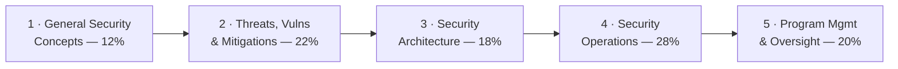

# 🛡️ CompTIA Security+ — Study Hub

### A step-by-step preparation guide for **CompTIA Security+ (SY0-701)**

*Concepts, real diagrams, and exam prep* — the **vendor-neutral, foundational** baseline for
a sysadmin moving into cybersecurity.

---

> [!NOTE]
> **Unofficial & no fabrication.** Not affiliated with or endorsed by CompTIA. Exam specifics
> are from CompTIA's official Security+ page; anything volatile (price, exam code, retirement
> date, Continuing Education / CEU renewal) should be re-checked there. Compiled
> **2026-06-20**; exam facts re-checked **2026-09-29**.

> [!IMPORTANT]
> **Version notice — this hub covers SY0-701 (V7).** SY0-701 retires **English 2027-06-11**;
> Japanese, Portuguese, Spanish, and Thai **2027-08-13** ([V7 page](https://www.comptia.org/en-us/certifications/security/v7/)). The successor
> **SY0-801 (V8)** launches **on or around 2026-11-17**, English only at launch: max 90
> questions, 90 minutes, 750 on 100–900; domains General Security Concepts 16%; Threats,
> Vulnerabilities, and Attacks 24%; Security Architecture 19%; Security Operations 27%;
> Security Program Management and Oversight 14% ([V8 page](https://www.comptia.org/en-us/certifications/security/v8/)). **Sitting SY0-801? Map
> your study to the SY0-801 objectives** — see the
> [version notice](00-overview/exam-and-objectives.md#version-notice--sy0-701-retires-sy0-801-is-coming).

## 📋 At a glance

| Item | Detail |
|------|--------|
| **Exam** | SY0-701 (V7) — retires English **2027-06-11**; successor SY0-801 from ~2026-11-17 |
| **Format** | Max **90 questions** — multiple-choice + **performance-based (PBQ)** |
| **Duration / pass** | **90 minutes** · **750** on a 100–900 scale |
| **Level** | Foundational, **vendor-neutral**, defensive-leaning |
| **Recommended** | Network+ and two years in a security / systems administrator job role *(not required)* |

Full details: **[exam & objectives](00-overview/exam-and-objectives.md)**.

## 🛠️ Prepare for it — the procedure

This hub is a **preparation guide**: follow the steps in order. The method is the repo-wide
[how to prepare a certification](../../learning/how-to-prepare-a-cert.md); the numbers below (80% per domain, 85% on a
full mock) are that method's readiness rule, not a CompTIA figure.

1. **Commit** — read [exam & objectives](00-overview/exam-and-objectives.md), confirm the
   current exam code and price on [CompTIA's page](https://www.comptia.org/en-us/certifications/security/), and set a target date.
   Plan on roughly **7 weeks at 8–10 hours a week** (~54–70 h total, summing the plan's suggested hours) — the
   [study plan](exam-prep/study-plan.md) breaks that down.
2. **Get the official objectives PDF** from CompTIA and fill the
   [coverage map](exam-prep/coverage-map.md): write each official objective number next to
   the topic row that covers it, mark any gap, and self-score every row 0–3 before you
   start (the method explains the scale).
3. **Study weight-first** — Domain 1 first (it is the vocabulary), then 4 → 2 → 3 → 5 by weight. For each domain: read the page, do the hands-on
   items it names (in the [CEH lab](../ceh/labs/README.md) or on a
   [practice platform](../../learning/platforms.md)), map each attack or control to the
   [attack → defense matrix](../../attack-to-defense-matrix.md), then take that domain's
   [practice questions](exam-prep/practice-questions.md). Log every miss, then
   drill the [flashcard deck](exam-prep/flashcards.csv) with `python3 certs/ceh/scripts/quiz.py --deck certs/security-plus/exam-prep/flashcards.csv` (from the repo root) or import it into Anki.
4. **Rehearse the PBQs** — performance-based questions open the exam and eat the clock; the
   study plan's PBQ section tells you how to drill them. Pace to remember: 90 questions in 90 minutes: one minute per item, and PBQs take longer.
5. **Pass the readiness gate** — every domain ≥ 80% on a second, spaced attempt; the timed
   [full mock exam](exam-prep/mock-exam.md) ≥ 85%; the [cheat sheet](exam-prep/cheat-sheet.md) · [acronyms](reference/acronyms.md) · [glossary](reference/glossary.md) automatic; no open weak-area row older than a week.
6. **Exam week** — logistics (ID, online-proctoring check or test-centre rules) three days
   out; final drill of the weak-area log; the exam-day tactics in the
   [CEH exam strategy](../ceh/EXAM-STRATEGY.md) apply unchanged to CompTIA multiple choice.
7. **After** — note CompTIA's continuing-education renewal rule from the objectives page and
   calendar it; return to the [roadmap](../../learning/roadmap.md) for the next milestone.

### 📈 Track it

| # | Domain | Weight | Read | Hands-on | Practice 1 | Practice 2 (spaced) |
|---|--------|--------|:----:|:--------:|:----------:|:-------------------:|
| 1 | [General Security Concepts](domains/01-general-security-concepts.md) | 12% | ☐ | ☐ | ____% | ____% |
| 2 | [Threats, Vulnerabilities & Mitigations](domains/02-threats-vulnerabilities-mitigations.md) | 22% | ☐ | ☐ | ____% | ____% |
| 3 | [Security Architecture](domains/03-security-architecture.md) | 18% | ☐ | ☐ | ____% | ____% |
| 4 | [Security Operations](domains/04-security-operations.md) | 28% | ☐ | ☐ | ____% | ____% |
| 5 | [Security Program Management & Oversight](domains/05-security-program-management-oversight.md) | 20% | ☐ | ☐ | ____% | ____% |

- [ ] Objectives PDF downloaded · self-assessment done · exam date `__________`
- [ ] Timed [full mock exam](exam-prep/mock-exam.md): ____% (target ≥ 85%) · exam booked `__________` · passed `__________`

## 🗺️ The five domains

| # | Domain | Weight | Page |
|---|--------|--------|------|
| 1 | General Security Concepts | 12% | [01-general-security-concepts.md](domains/01-general-security-concepts.md) |
| 2 | Threats, Vulnerabilities & Mitigations | 22% | [02-threats-vulnerabilities-mitigations.md](domains/02-threats-vulnerabilities-mitigations.md) |
| 3 | Security Architecture | 18% | [03-security-architecture.md](domains/03-security-architecture.md) |
| 4 | Security Operations | 28% | [04-security-operations.md](domains/04-security-operations.md) |
| 5 | Security Program Management & Oversight | 20% | [05-security-program-management-oversight.md](domains/05-security-program-management-oversight.md) |

## 📦 What's inside

| Section | Contents |
|---------|----------|
| **[Overview](00-overview/what-is-security-plus.md)** | [What is Security+](00-overview/what-is-security-plus.md) · [Exam & objectives](00-overview/exam-and-objectives.md) |
| **[The 5 domains](domains/README.md)** | Each domain taught to the SY0-701 objectives, with diagrams & exam tips |
| **[Exam prep](exam-prep/study-plan.md)** | [Study plan](exam-prep/study-plan.md) · [Coverage map](exam-prep/coverage-map.md) · [Flashcards](exam-prep/flashcards.csv) · [Practice questions](exam-prep/practice-questions.md) · [Full mock exam](exam-prep/mock-exam.md) · [Cheat sheet](exam-prep/cheat-sheet.md) |
| **[Reference](reference/acronyms.md)** | [Acronyms](reference/acronyms.md) (the famously long Security+ list) · [Glossary](reference/glossary.md) |

## 🧭 Where it fits

Security+ is the **breadth baseline** you earn early — before specializing. It pairs naturally
with the rest of this repo:

- **Offensive next step** → the [CEH hub](../ceh/README.md) adds the attacker's lens on top.
- **Defensive / identity depth** → the [PAM foundations](../../foundations/README.md)
  operationalize the access-control, identity, and least-privilege concepts Security+ surveys.
- **Mechanisms** → the [protocols](../../protocols/README.md) pages explain the crypto, TLS,
  Kerberos, SAML, and 802.1X that Security+ references.
- **Career path** → see the [learning roadmap](../../learning/roadmap.md) and
  [platforms](../../learning/platforms.md).

## 🔗 Quick links

- 🎓 [CompTIA Security+ (official)](https://www.comptia.org/en-us/certifications/security/)
- 🧠 [Acronyms](reference/acronyms.md) · [Glossary](reference/glossary.md)
- 📝 [Full mock exam](exam-prep/mock-exam.md) (85 MCQ + 5 PBQ, timed, gate ≥ 85%) · [Practice questions](exam-prep/practice-questions.md)
- 🧪 [The 5 domains](domains/README.md)

> CompTIA and Security+ are trademarks of CompTIA, used here for identification and
> educational purposes only.
