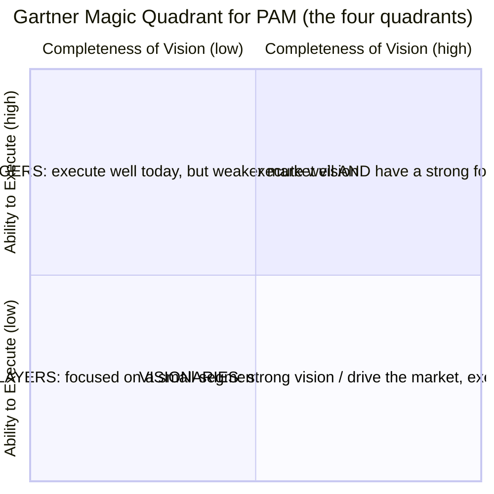
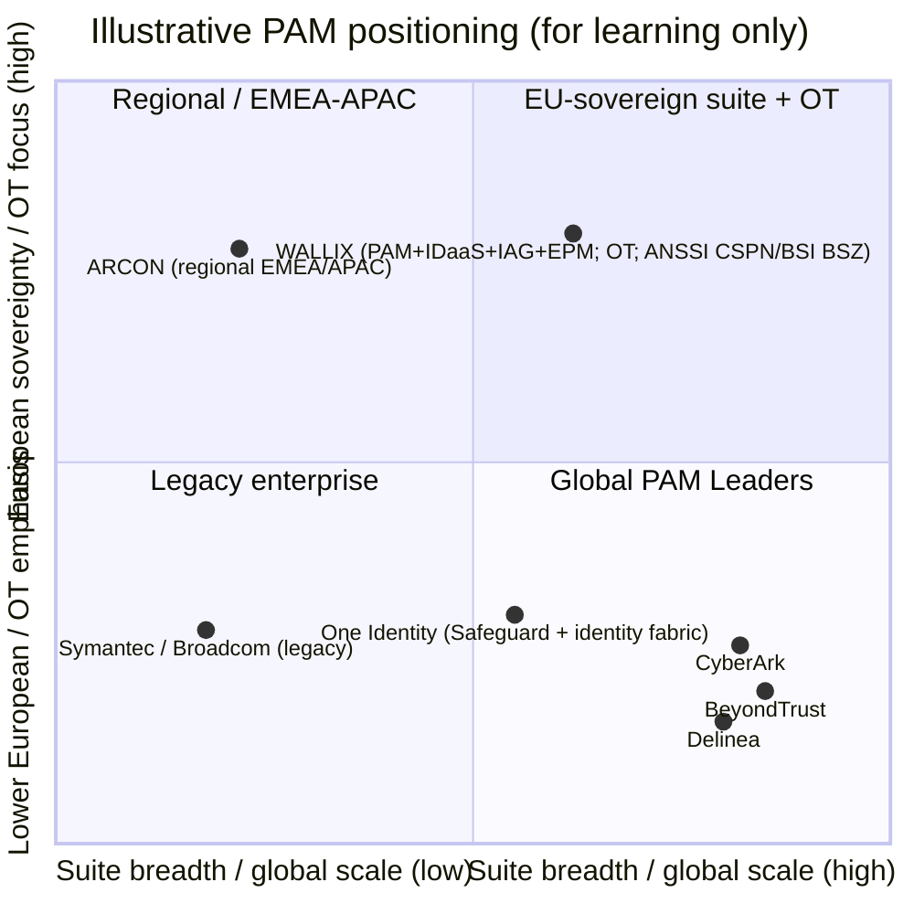

# The PAM Market Landscape — Vendors and Analyst Frameworks

*Compiled 2026-06-17 from analyst press summaries, vendor product pages, and vendor press releases. Placements and rankings change every year — each one below is tagged with the year of the report it comes from. Where a fact could not be confirmed in the sources consulted, it is marked "not specified in sources."*

This page is written for a systems administrator beginning a cybersecurity career in **Privileged Access Management (PAM)**. It explains the two analyst frameworks buyers rely on, compares the major vendors factually, and shows how the global leaders and the regional specialists differentiate from one another.

For the product categories these vendors sell (PAM, IDaaS, IGA, EPM, CIEM), see [pam-iam-iga-idaas-epm.md](pam-iam-iga-idaas-epm.md). For how a sysadmin builds toward a PAM role, see [../learning/roadmap.md](../learning/roadmap.md) and [../certs/adjacent-certs/README.md](../certs/adjacent-certs/README.md).

---

## Key points

- **PAM (Privileged Access Management)** is a mature, consolidated market with a small number of large global vendors and several regional specialists.
- Two analyst frameworks dominate buyer shortlists: the **Gartner Magic Quadrant (MQ) for PAM** and the **KuppingerCole Leadership Compass for PAM**.
- In the **2025 Gartner MQ for PAM**, the Leaders were **CyberArk, BeyondTrust, and Delinea**; **One Identity** and **WALLIX** were **Visionaries** (WALLIX for the third consecutive year, and described as the **only European vendor** in the quadrant).
- In the **KuppingerCole Leadership Compass for PAM 2026**, the Overall Leaders included the usual global leaders plus **WALLIX** (its fifth consecutive year), out of 35+ vendors evaluated.
- **Market-fact update (checked 2026-09-29):** **Palo Alto Networks completed its acquisition of CyberArk on 2026-02-11**, and in 2026 introduced **Idira** as the identity security platform "built on CyberArk's legacy and powered by Palo Alto Networks"; CyberArk products are being rebranded under the Idira name in phases. The CyberArk analyst placements on this page are historical facts for their report dates (e.g. the 2025 Gartner MQ), when CyberArk was an independent company.
- Beyond raw scale, vendors differentiate on **regional/digital sovereignty** and national security certifications (e.g. **ANSSI CSPN**, **BSI BSZ**), **simplicity / SME focus**, **OT (Operational Technology)** coverage, **remote/third-party access**, and how much of an integrated suite (**PAM + IDaaS + IGA + EPM**) they offer.

---

## Acronyms used on this page

| Acronym | Expansion | One-line meaning |
|---|---|---|
| **PAM** | Privileged Access Management | Securing, brokering, and auditing high-privilege accounts/sessions |
| **MQ** | Magic Quadrant | Gartner's 2-axis vendor positioning chart |
| **PASM** | Privileged Account & Session Management | Vaulting credentials + brokering/recording sessions |
| **PEDM** | Privilege Elevation & Delegation Management | Least-privilege/elevation on endpoints and servers |
| **JIT** | Just-in-Time (access) | Privilege granted only for a task, then revoked |
| **ZSP** | Zero Standing Privileges | No permanent admin rights left lying around |
| **EPM** | Endpoint Privilege Management | Removing local admin / controlling app privileges on endpoints |
| **IDaaS** | Identity-as-a-Service | Cloud SSO / MFA / federation |
| **IAG / IGA** | Identity & Access Governance / Identity Governance & Administration | "Who has access to what, and should they?" |
| **OT** | Operational Technology | Industrial control systems (ICS/SCADA/PLCs) |
| **CPS** | Cyber-Physical Systems | Systems bridging the digital and physical (OT + IoT) |
| **SaaS** | Software-as-a-Service | Vendor-hosted, subscription, auto-updated |
| **ANSSI** | Agence nationale de la sécurité des systèmes d'information | France's national cybersecurity agency |
| **CSPN** | Certification de Sécurité de Premier Niveau | ANSSI's first-level security certification |
| **BSI** | Bundesamt für Sicherheit in der Informationstechnik | Germany's federal cybersecurity office |
| **BSZ** | Beschleunigte Sicherheitszertifizierung | BSI's "accelerated security certification" |
| **NIS2 / DORA** | Network & Information Security Directive 2 / Digital Operational Resilience Act | EU cybersecurity regulations driving PAM demand |

---

## 1. What PAM is, and why analysts rank it

Privileged accounts (root, domain admin, service accounts, cloud IAM roles, OT engineering logins) are the keys to the kingdom: stolen or misused privileged credentials are a leading breach vector. A PAM platform typically provides:

- a **vault** for privileged credentials and secrets, with automatic rotation;
- a **session broker/proxy** that connects an admin to a target without exposing the password, and **records** the session;
- **JIT** access and **least-privilege**/**ZSP** controls to remove standing admin rights;
- **audit** trails for compliance.

Because every regulated organization needs this and the products are complex, buyers lean heavily on independent analyst evaluations to build shortlists. The two that matter most in PAM are Gartner's Magic Quadrant and KuppingerCole's Leadership Compass.

---

## 2. The analyst frameworks

### 2.1 Gartner Magic Quadrant (MQ) for PAM

The **Magic Quadrant** is Gartner's signature comparison chart. It plots vendors on **two axes** and splits the field into **four quadrants**:

- **Ability to Execute** (vertical axis) — financial viability, market responsiveness, product maturity, sales/support, customer base. *How well do they deliver today?*
- **Completeness of Vision** (horizontal axis) — innovation and understanding of where the market is going. *Do they lead or follow the market?*

- **Leaders (upper-right):** execute well and are well positioned for the future.
- **Challengers (upper-left):** execute strongly today but show less market vision.
- **Visionaries (lower-right):** understand or drive where the market is heading, but do not yet execute as broadly (often smaller, more innovative, or regionally focused).
- **Niche Players (lower-left):** succeed in a specific segment, or are still building out.

> **Reading tip:** "Visionary" is **not** a lesser grade than "Leader" on the same scale — it means strong *vision* with narrower *execution/scale* (frequently a smaller or regional vendor). For a buyer who values innovation and fit over sheer global footprint, Visionaries are legitimate shortlist candidates.

**Placements in the 2025 Gartner MQ for PAM** (report published 13 Oct 2025; the full quadrant graphic is behind Gartner's paywall, so these come from the vendors' own press releases):

| Vendor | 2025 placement | Notes |
|---|---|---|
| **CyberArk** | **Leader** | Positioned furthest in Completeness of Vision. |
| **BeyondTrust** | **Leader** | Positioned highest in Ability to Execute. |
| **Delinea** | **Leader** | Seventh consecutive Leader placement (as Thycotic/Centrify before the merger). |
| **One Identity** | **Visionary** | Safeguard within the One Identity fabric. |
| **WALLIX** | **Visionary** (3rd consecutive year, 2023–2025) | States it is the **only European vendor** in the quadrant. Cited strengths: remote-access coverage of all major session protocols, **OT/CPS** (industrial / cyber-physical) coverage, and customer proximity. |

### 2.2 KuppingerCole Leadership Compass for PAM

**KuppingerCole** is a European (German) analyst firm. Its **Leadership Compass** evaluates a market and rates vendors across **four leadership categories** rather than a single chart:

- **Product Leadership** — functional completeness of the product.
- **Innovation Leadership** — forward-looking capabilities and roadmap.
- **Market Leadership** — customer base, partner ecosystem, financial/market reach.
- **Overall Leadership** — a combined view of the three above.

A vendor named an **Overall Leader** scores strongly across all dimensions. The PAM Leadership Compass evaluates a large field — **35+ vendors** in the 2026 edition.

The 2026 edition (published 28 May 2026) named the global leaders as Overall Leaders and also **WALLIX** for the fifth consecutive year, citing **agentless** identity/session management, **OT/industrial** support (called a "rare differentiator"), browser-based session access, metadata-enriched session recording with real-time alerts, standing-privilege reduction, and **alignment with European digital sovereignty** ("particularly relevant for organizations with strong European assurance requirements").

> **Why two frameworks differ for the same vendor:** Gartner's single MQ blends scale-heavy "execution" with "vision," so a strong-but-smaller regional vendor (WALLIX is the clearest example) lands as a **Visionary**. KuppingerCole rates **Product/Innovation/Market separately** and combines them, so the same vendor can reach **Overall Leader**. Neither is "wrong" — they weight market footprint differently. Always read the *year* and the *methodology*, not just the label.

---

## 3. Major PAM vendors — balanced comparison

The table below is a factual snapshot for orientation, not an endorsement. "Adjacent" rows are tools often discussed alongside PAM but whose primary job is different (secrets management or cloud privileged identity), included because buyers frequently compare them.

| Vendor / Product | Primary focus | Deployment | Notable strengths | Typical buyer |
|---|---|---|---|---|
| **CyberArk** (Privileged Access Manager; Privilege Cloud) — part of Palo Alto Networks since 2026-02-11, rebranding as **Idira** | Full-suite PAM + broader Identity Security platform | SaaS **and** self-hosted (on-prem / private / public cloud) | Most widely deployed enterprise PAM; deep vaulting, session isolation, JIT/ZSP; endpoint-to-cloud-to-DevOps breadth under one platform; **2025 Gartner Leader** | Large enterprises, regulated industries, complex multi-cloud estates |
| **BeyondTrust** (Password Safe; Privileged Remote Access; Privilege Management) | Full-suite PAM with strong remote-access and endpoint privilege | SaaS, on-prem, hybrid (virtual/physical appliances; AWS/Azure) | Strong session recording/audit; secure remote access; flexible deployment; **2025 Gartner Leader** (often cited highest in Ability to Execute) | Enterprises prioritizing third-party/remote access and session visibility |
| **Delinea** (Secret Server; Privilege Manager; Connection Manager; Cloud Suite) | Full-suite PAM; ease-of-use heritage | SaaS (Secret Server Cloud) **and** on-prem | Formed Apr 2021 from the **Thycotic + Centrify** merger (rebranded Delinea 2022); Secret Server vaulting is widely adopted and quick to deploy; **2025 Gartner Leader** | Mid-market to enterprise wanting fast time-to-value |
| **One Identity** (Safeguard) | PAM (PASM) within the One Identity Fabric (IAM/IGA/AD mgmt) | Appliance / virtual / cloud | Vaulting + session management + behavioral analytics; integrates with broader identity governance; **2025 Gartner Visionary** | Organizations standardizing on the One Identity ecosystem |
| **ARCON** (PAM) | PAM with built-in analytics | On-prem and cloud *(secondary source)* | Privileged accounts, credentials, sessions and secrets with least privilege and JIT; ITDR; ML-based anomaly detection ("Knight Analytics") per ARCON; MFA/SSO and strength in EMEA/APAC/Middle East per a secondary source only | Cost-sensitive enterprises in emerging markets; regional buyers |
| **Broadcom / Symantec** (Symantec Privileged Access Manager) | PAM within Broadcom's enterprise security portfolio | On-prem and cloud (appliance-based) | Originally CA Technologies; vaulting, session management, granular access; integrates with the wider Broadcom/Symantec stack | Existing Broadcom/Symantec enterprise customers |
| **HashiCorp Vault** *(adjacent — secrets management)* | Machine/application **secrets management**, dynamic secrets, PKI, encryption-as-a-service | Self-managed (Community or Enterprise) or managed (HCP Vault Dedicated) | **Dynamic credentials generated on demand**; PKI and Transit (encryption-as-a-service) secrets engines; engines for AWS, Azure and Google Cloud | DevOps/platform teams securing application-to-application secrets |
| **Microsoft Entra Privileged Identity Management (PIM)** *(adjacent — cloud privileged identity)* | **JIT, time-/approval-based activation** of privileged roles | SaaS (part of Microsoft Entra ID / ID Governance) | Native JIT role activation and access reviews for Entra ID, Azure, Microsoft 365/Intune; tight Microsoft ecosystem fit | Microsoft-centric orgs governing cloud admin roles |
| **WALLIX** (Bastion; WALLIX One; Trustelem; IAG; BestSafe) | Full-suite PAM + integrated identity security, **European-sovereign**, IT **and** OT | On-prem, private/public cloud, **SaaS** (WALLIX One), hybrid; **agentless** on targets | European sovereignty + sovereign certifications (ANSSI CSPN, BSI BSZ); simplicity/SME focus; strong **OT** coverage; integrated **PAM + IDaaS + IAG + EPM**; **2025 Gartner Visionary**, **KuppingerCole Overall Leader (2026)** | European public sector, SMEs/mid-market, industrial/OT operators, sovereignty-sensitive buyers |

> **Caveats:** Vendor product names and deployment options evolve; confirm current details on each vendor's site. The "typical buyer" column is generalized positioning. Gartner placements cited are from the **2025** MQ specifically.

---

## 4. How vendors differentiate beyond scale

The global leaders (CyberArk, BeyondTrust, Delinea) compete on breadth and footprint. Everyone else competes on a narrower axis. Knowing these axes helps you read any vendor pitch — or job description — quickly.

| Differentiation axis | What it means | Who plays there (examples) | Why it matters |
|---|---|---|---|
| **Regional / digital sovereignty** | Vendor developed and hosted inside the buyer's jurisdiction; EU data residency. | WALLIX (French; the only European vendor in the 2025 Gartner MQ, per its own press); ARCON in EMEA/APAC. | EU public sector and regulated firms increasingly require sovereign suppliers. Aligns with **NIS2** and **DORA**. |
| **National security certifications** | Government-grade product evaluation such as **ANSSI CSPN** (France) or **BSI BSZ** (Germany), with ANSSI↔BSI mutual recognition. | WALLIX holds ANSSI CSPN and, since 29 Sep 2025, BSI BSZ on its PAM v12.0.14. Other vendors typically cite Common Criteria, FIPS 140, or SOC 2 instead. | A procurement gate for sovereign and critical-infrastructure buyers. Always check *which* certification and *which* product version. |
| **Simplicity & SME/mid-market focus** | Agentless on targets; fast deployment; SaaS delivery aimed at organizations without large security teams. | Delinea (Secret Server time-to-value), WALLIX (WALLIX One SaaS). | Lowers the skills/effort barrier — attractive where the cybersecurity skills shortage bites hardest. |
| **Remote / third-party access** | Vendor-and-contractor access through the PAM gateway without VPN. | BeyondTrust (Privileged Remote Access), CyberArk, WALLIX. | Third-party access is a leading breach vector and an audit focus. |
| **OT / industrial security** | Agentless access to PLCs/HMIs; industrial-protocol handling; alliances with OT vendors (Schneider Electric, Cisco, Nozomi). | WALLIX — analysts (Gartner 2025, KuppingerCole 2026) call its OT/CPS coverage a genuine differentiator; see [../certs/ceh/ot-security/05-pam-for-ot.md](../certs/ceh/ot-security/05-pam-for-ot.md). | Industrial operators need privileged-access control without disrupting production — an area many IT-only PAM tools cover weakly. |
| **Integrated identity suite (PAM + IDaaS + IGA + EPM)** | One vendor across vaulting/sessions, SSO/MFA, governance, and endpoint least-privilege. | CyberArk (Identity Security Platform), One Identity (fabric), WALLIX (PAM + IDaaS + IAG + EPM). | Fewer vendors to integrate; converges PAM with identity governance and endpoint least-privilege under a single roof. |
| **Secrets / DevOps** | Machine-to-machine secrets, dynamic credentials, PKI. | HashiCorp Vault (adjacent), CyberArk Conjur. | Application secrets sprawl is a separate problem from human admin sessions. |

---

## 5. A simple positioning sketch

This is an **illustrative** sketch (not a reproduction of any analyst chart) to help a newcomer visualize where vendors tend to sit. Horizontal axis = **breadth/scale of the global suite**; vertical axis = **European sovereignty / regional + OT focus**. Positions are approximate and for learning only.

Adjacent tools (different primary job, often compared to PAM, sitting outside the core PAM box):

| Tool | Primary job |
|---|---|
| **HashiCorp Vault** | machine/app secrets, dynamic creds (DevOps) |
| **Microsoft Entra PIM** | JIT activation of cloud admin roles (Microsoft ecosystem) |

**How to read it:** The global **Leaders** (CyberArk, BeyondTrust, Delinea) dominate the high-scale right side. **WALLIX** occupies the upper-right blend of **suite breadth plus European sovereignty and OT** — the lane that earns it "Visionary" at Gartner and "Overall Leader" at KuppingerCole. **ARCON** sits in the regional lane on the left. The adjacent tools sit outside the core PAM box because their primary purpose is secrets management (Vault) or cloud-role JIT (Entra PIM), not full session-brokering PAM.

---

## 6. Takeaways for a PAM career starter

- **Learn the leaders' concepts, not just one product.** Vaulting, session brokering/recording, JIT, ZSP, and PEDM are universal across CyberArk, BeyondTrust, Delinea, and WALLIX — skills transfer.
- **Know the frameworks by name and year.** Saying "WALLIX was a Gartner *Visionary* in the 2025 MQ and a KuppingerCole *Overall Leader* in 2026" is precise; "WALLIX is top-rated" is not.
- **Sovereignty and OT are growth lanes.** EU regulation (NIS2, DORA) and industrial security are where European specialists like WALLIX differentiate — useful context if you target EU public-sector or industrial employers.
- **Adjacent tools are not substitutes.** Expect to integrate PAM with secrets managers (Vault) and cloud-identity JIT (Entra PIM) rather than replace one with the other.
- **Concepts before products.** Product skills follow from the product your target employers run; this repo deliberately does not cover vendor PAM certification tracks. See [../learning/roadmap.md](../learning/roadmap.md).

---

## Sources

- Gartner — Magic Quadrant Research Methodology: https://www.gartner.com/en/research/methodologies/magic-quadrants-research
- Gartner — Magic Quadrant for Privileged Access Management (document landing): https://www.gartner.com/en/documents/7051198
- WALLIX — "Recognized as a Visionary for the third consecutive year in the 2025 Gartner Magic Quadrant for PAM Solutions": https://www.wallix.com/press/wallix-recognized-as-a-visionary-for-the-third-consecutive-year-in-the-2025-gartner-magic-quadrant-for-pam-solutions/
- Euronext — WALLIX 2025 Gartner Visionary (company news, 14 Oct 2025): https://live.euronext.com/en/products/equities/company-news/2025-10-14-wallix-recognized-visionary-third-consecutive-year-2025
- CyberArk — "Named a Leader in the 2025 Gartner Magic Quadrant for PAM": https://www.cyberark.com/press/cyberark-named-a-leader-in-the-2025-gartner-magic-quadrant-for-privileged-access-management/
- BeyondTrust — 2025 Gartner Magic Quadrant for PAM: https://www.beyondtrust.com/blog/entry/gartner-pam-magic-quadrant
- Delinea — "Named a Leader in 2025 Gartner Magic Quadrant for PAM for seventh consecutive time": https://delinea.com/news/delinea-named-a-leader-in-2025-gartner-magic-quadrant-for-pam-for-seventh-consecutive-time
- One Identity — "Named a Visionary in the 2025 Gartner Magic Quadrant for PAM": https://www.oneidentity.com/analyst-report/one-identity-is-named-a-visionary-in-the-2025-gartner-magic-quadrant-for-pam/
- KuppingerCole — Leadership Compass: Privileged Access Management: https://www.kuppingercole.com/research/lc80830/privileged-access-management
- WALLIX — "Recognized for the fifth consecutive year as an Overall Leader in KuppingerCole's Leadership Compass PAM 2026": https://www.wallix.com/press/wallix-recognized-for-the-fifth-consecutive-year-as-an-overall-leader-in-kuppingercole-s-leadership-compass-pam-2026/
- CyberArk — Privileged Access Manager product page: https://www.cyberark.com/products/privileged-access-manager/
- BeyondTrust — Password Safe: https://www.beyondtrust.com/products/password-safe
- BeyondTrust — Privileged Remote Access: https://www.beyondtrust.com/products/privileged-remote-access
- Delinea — "ThycoticCentrify is now Delinea" (merger/rebrand): https://delinea.com/news/thycoticcentrify-is-now-delinea
- TPG (TPG-led investor group) — "TPG Announces merger of Thycotic and Centrify": https://delinea.com/news/tpg-led-investor-group-announces-combination-thycotic-and
- One Identity — Safeguard: https://www.oneidentity.com/one-identity-safeguard/
- Broadcom — Symantec Privileged Access Manager: https://www.broadcom.com/products/identity/pam
- ARCON — Privileged Access Management: https://arconnet.com/privileged-access-management
- ARCON — Knight Analytics (AI/ML): https://arconnet.com/resources/video/arcon-knight-analytics-leverages-ai-ml-to-mitigate-it-risks/
- ARCON — ITDR with IAM (blog): https://arconnet.com/blog/the-five-reasons-why-organizations-will-integrate-itdr-with-iam-system/
- Secondary source (ARCON deployment, MFA/SSO and regional claims only) — gbhackers, Top PAM companies 2026: https://gbhackers.com/best-privileged-access-management-pam-companies/
- HashiCorp — What is Vault? (deployment options): https://developer.hashicorp.com/vault/docs/what-is-vault
- HashiCorp — Vault secrets engines (dynamic secrets, PKI, Transit): https://developer.hashicorp.com/vault/docs/secrets
- Palo Alto Networks — "Completes Acquisition of CyberArk to Secure the AI Era" (2026-02-11): https://www.paloaltonetworks.com/company/press/2026/palo-alto-networks-completes-acquisition-of-cyberark-to-secure-the-ai-era
- Palo Alto Networks — Idira (CyberArk rebrand): https://www.paloaltonetworks.com/idira
- CyberArk community — "CyberArk is now Idira: FAQ": https://community.cyberark.com/s/article/CyberArk-is-now-Idira-Frequently-Asked-Questions
- Microsoft Learn — "What is Privileged Identity Management?" (Entra PIM): https://learn.microsoft.com/en-us/entra/id-governance/privileged-identity-management/pim-configure
- WALLIX — "Achieves dual certifications in Germany and France (ANSSI CSPN / BSI BSZ)": https://www.wallix.com/press/wallix-achieves-dual-certifications-in-germany-and-france-reinforcing-its-position-as-a-trusted-european-cybersecurity/
- Actusnews — WALLIX dual certification (8 Oct 2025, BSZ on v12.0.14, 29 Sep 2025): https://www.actusnews.com/en/wallix/pr/2025/10/08/wallix-achieves-dual-certifications-in-germany-and-france-reinforcing-its-position-as-a-trusted-european-cybersecurity-partner
- Magic Quadrant overview (background): https://en.wikipedia.org/wiki/Magic_Quadrant
