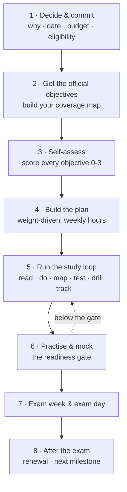
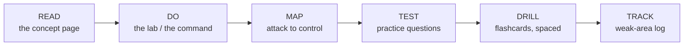

# How to prepare a certification — the method

The one procedure this repo uses for every certification, from CEH to CISSP. Each cert hub
applies it to its own exam (the hub's README carries the concrete checklist and the
week-by-week plan); this page is the method itself, so you learn it once.

> *The exam facts referenced here (formats, cut-scores, policies) live in each hub and are
> sourced from the exam body. The **thresholds** in this page (80% per domain, 85% on a
> full-length mock) are this repo's own readiness rule, not an exam-body requirement.*

## Learning objectives

- Run a certification preparation as a **project**: a date, a scope, a plan, a readiness gate.
- Use a study loop built on **retrieval practice, spacing and labs** instead of re-reading.
- Know what "ready to book" looks like, and what to do in exam week and after the exam.

## The eight steps

### Step 1 — Decide and commit

- **Why this cert, now?** Write one sentence tying it to the [skill path](roadmap.md) (which
  competency it proves and which level it unlocks). If you cannot, pick a different one.
- **Eligibility.** Some exams require training or documented experience before you can book
  (CEH does; CompTIA exams do not). Read the hub's *exam & eligibility* page first.
- **Budget.** Voucher, retake policy, training (if mandatory), lab or range subscriptions,
  and a proctoring setup. Fill the *verify* fields in the hub from the exam body's site.
- **Date.** Choose a target exam date and work backwards. A date on the calendar is what
  turns "studying" into "preparing".

### Step 2 — Get the official objectives

Download the exam body's **objectives / blueprint** document and keep it next to you. It is
the contract: anything on it can be asked, anything off it will not be.

- Build a **coverage map**: one row per objective, with the repo page that covers it and a
  status column. The CEH hub's [blueprint coverage matrix](../certs/ceh/BLUEPRINT-COVERAGE.md)
  is the worked example.
- Note the **domain weights** where the body publishes them (CompTIA does; EC-Council's public
  figures disagree, so record the ones in the PDF you downloaded).

### Step 3 — Self-assess

Score every objective **0–3** before studying:

| Score | Meaning |
|-------|---------|
| 0 | Never heard of it |
| 1 | Recognise it, could not explain it |
| 2 | Can explain it; have not done it hands-on |
| 3 | Can do it cold, under time, and explain the defence |

The zeros and ones are your syllabus. A sysadmin usually starts most infrastructure,
directory and networking objectives at 2, which is why the plans in this repo front-load the
attack-side and analysis material instead.

### Step 4 — Build the plan

- **Weight-driven order:** biggest domain first, unless a smaller one is a prerequisite.
- **Weekly hours, not "when I have time".** The hub plans assume a working professional at
  roughly 8–10 hours a week. Halve the pace rather than skip the labs.
- **Fixed slots:** short daily recall (10–15 minutes of flashcards) plus two longer blocks
  for reading and lab work.
- **Milestones with a test:** every week ends with something you can *do* or *score*, never
  with "finished reading".

### Step 5 — Run the study loop

The same six moves for every module or domain:

- **Read once, then close the page.** Re-reading builds recognition; the exam needs recall.
  Retrieval practice (self-testing) and spacing are the two techniques with the strongest
  evidence in the learning-science literature.
- **Do it.** Run every key command at least once in the [lab](../certs/ceh/labs/README.md)
  or on a [practice platform](platforms.md). Tool-to-purpose pairs stick when your hands did
  them.
- **Map it.** For every attack, name the control that stops it; for every control, name the
  attack it stops. The [attack → defense matrix](../attack-to-defense-matrix.md) is the
  reference. This is the retention hook for a PAM professional and it answers a large share
  of "best defence" questions.
- **Test honestly**, then log every miss in a **weak-area log** (date, topic, what you got
  wrong, fixed?). Re-test the log first at the next session. Your misses are your syllabus.
- **Drill with spacing:** day 0 learn, day 1 flashcards, day 3 questions, day 7 the fact
  sheet, day 21 a mixed set. Anki schedules this for you; every hub ships a
  `flashcards.csv` deck that imports directly or drills in the terminal.
- **Interleave** once you have several modules behind you: mix their questions, because the
  exam does.

### Step 6 — Practise and mock: the readiness gate

Book the exam when **all** of these hold, not before:

- [ ] Every objective on the coverage map is at self-score 2 or 3.
- [ ] Each domain's practice set scores **≥ 80%** on a second, spaced attempt.
- [ ] A **full-length, timed mock** scores **≥ 85%** with the pace the real exam demands.
- [ ] Performance-based or hands-on items (PBQs, a lab chain, a report) completed under a
  self-imposed time box without notes.
- [ ] The weak-area log has no open rows older than a week.

Practice questions in this repo are **original**, written to the objectives. Never use exam
dumps: they violate every exam body's candidate agreement and get certifications revoked.

### Step 7 — Exam week and exam day

- **Seven days out:** stop learning new material. Drill fact sheets, cheat sheets and the
  weak-area log. One last full mock, then rest.
- **Logistics:** ID that matches the booking, the proctoring room or test-centre rules, the
  software check for online proctoring, the exam-body confirmation email. Do these three
  days before, not the morning of.
- **On the day:** compute the pace (questions ÷ minutes) and write it down. First pass fast,
  flag anything over the pace, second pass on flags, no blanks. Underline qualifiers
  (*BEST, MOST, FIRST, NOT, EXCEPT*). Change an answer only with a concrete reason.
- **Hands-on exams** (OSCP, PNPT, CEH Practical): notes and screenshots as you go, the
  [report template](../certs/oscp/exam-prep/report-template.md) filled in as you go, and
  rest scheduled into the window. For the PNPT, rehearse the
  [debrief](../certs/pnpt/exam-prep/debrief-outline.md) out loud.

### Step 8 — After the exam

- Record the result and the date in the hub's progress tracker.
- Note the **renewal rule** (continuing-education credits, validity period) from the exam
  body while it is fresh, and calendar the first deadline.
- Go back to the [roadmap](roadmap.md): tick the milestone, and start Step 1 for the next
  one. The skills, not the badge, are the goal.

## Templates

**Study log** (one line per session):

| Date | Module / domain | Loop step | Time | Result |
|------|-----------------|-----------|------|--------|
| | | read / do / map / test / drill | | score or checkpoint |

**Weak-area log:**

| Date | Topic | What I got wrong | Fixed? |
|------|-------|------------------|--------|
| | | | |

**Readiness gate** — copy the checklist from Step 6 into the hub's progress page and tick it.

## How this repo supports each step

| Step | Where |
|------|-------|
| 1 · Eligibility, format, cost fields | Each hub's *exam & eligibility* / *exam structure* page; CEH: [exam logistics](../certs/ceh/EXAM-LOGISTICS.md) |
| 2 · Coverage map | [CEH blueprint coverage](../certs/ceh/BLUEPRINT-COVERAGE.md) · coverage maps for [Security+](../certs/security-plus/exam-prep/coverage-map.md) · [CySA+](../certs/cysa-plus/exam-prep/coverage-map.md) · [PenTest+](../certs/pentest-plus/exam-prep/coverage-map.md) · [OSCP](../certs/oscp/exam-prep/coverage-map.md) · [PNPT](../certs/pnpt/exam-prep/coverage-map.md) — fill the official objective numbers from the PDF |
| 3 · Self-assessment | [CEH competency self-assessment](../certs/ceh/ROADMAP.md#where-are-you--competency-self-assessment); the [roadmap](roadmap.md) level exit criteria |
| 4 · Plan | Each hub's study plan: [CEH](../certs/ceh/STUDY-PLAN.md) · [Security+](../certs/security-plus/exam-prep/study-plan.md) · [CySA+](../certs/cysa-plus/exam-prep/study-plan.md) · [PenTest+](../certs/pentest-plus/exam-prep/study-plan.md) · [PNPT](../certs/pnpt/exam-prep/study-plan.md) · [OSCP](../certs/oscp/exam-prep/study-plan.md) · [CISSP](../certs/adjacent-certs/cissp-study-plan.md) · [cloud security](../certs/adjacent-certs/cloud-security-study-plan.md) |
| 5 · Study loop | Concept pages + labs + [attack → defense matrix](../attack-to-defense-matrix.md) + practice questions + flashcard decks in every hub (`exam-prep/flashcards.csv`; drill any deck with `python3 certs/ceh/scripts/quiz.py --deck <file>`) + [platforms](platforms.md) + the [CEH practice kit](../certs/ceh/resources/practice-labs.md) |
| 6 · Mocks | [CEH 50-question](../certs/ceh/MOCK-EXAM.md) · [125-question](../certs/ceh/MOCK-EXAM-FULL.md) · [rapid-fire bank](../certs/ceh/RAPID-FIRE.md); timed full mocks with PBQ-style scenarios for [Security+](../certs/security-plus/exam-prep/mock-exam.md) · [CySA+](../certs/cysa-plus/exam-prep/mock-exam.md) · [PenTest+](../certs/pentest-plus/exam-prep/mock-exam.md); hands-on exams: the [report template](../certs/oscp/exam-prep/report-template.md) and the [PNPT debrief outline](../certs/pnpt/exam-prep/debrief-outline.md) |
| 7 · Exam week | [CEH exam strategy](../certs/ceh/EXAM-STRATEGY.md) (the tactics apply to every multiple-choice exam) |
| 8 · Tracking | [CEH progress tracker](../certs/ceh/PROGRESS.md); the *Track it* table in every other hub README and in the CISSP and cloud study plans |

## Sources

- Dunlosky, J. et al. (2013), *Improving Students' Learning With Effective Learning
  Techniques*, Psychological Science in the Public Interest 14(1) — practice testing and
  distributed practice rated highest-utility: https://doi.org/10.1177/1529100612453266
- Retrieval Practice (research summaries on retrieval, spacing and interleaving):
  https://www.retrievalpractice.org/
- EC-Council, CEH program and eligibility: https://www.eccouncil.org/train-certify/certified-ethical-hacker-ceh/
- CompTIA certifications (objectives PDFs, exam policies): https://www.comptia.org/
- OffSec, PEN-200 / OSCP: https://www.offsec.com/courses/pen-200/
- TCM Security, PNPT: https://certifications.tcm-sec.com/pnpt/
- Repo thresholds (80% per domain, 85% full mock) are this repo's own rule, consistent with
  the CEH hub's [exam strategy](../certs/ceh/EXAM-STRATEGY.md); *not specified in sources*
  by any exam body.
