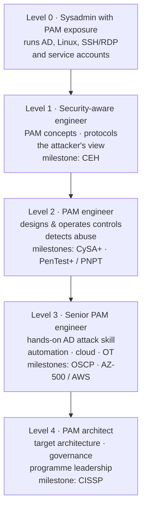
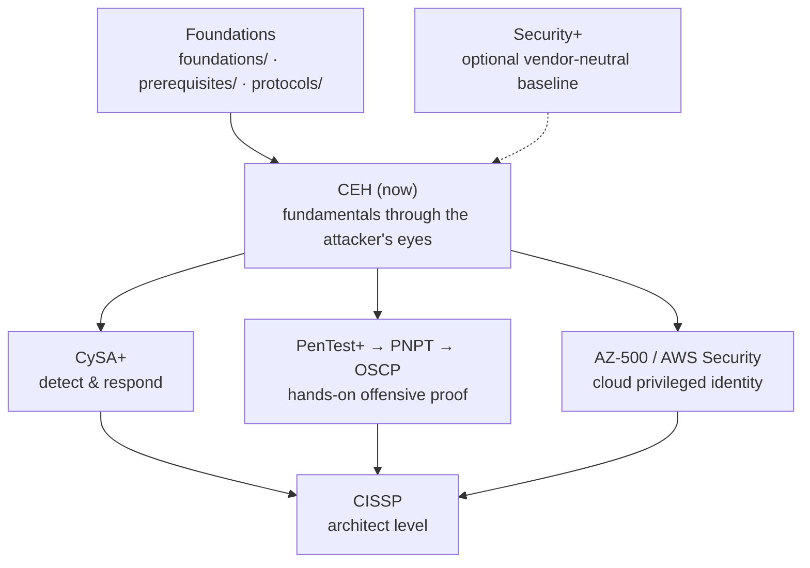

# Roadmap — from sysadmin to PAM architect

A professional **learning path**, not just a certification list. It ties this repo's material
into one journey: the competencies a Privileged Access Management (PAM) architect needs, the
order to build them in, what "done" looks like at each level, and which certification marks
each milestone. Certifications are proof points; the skills are the goal.

> *This is **suggested guidance**, not a prescriptive or official path — order it to your
> goals and employer. Certification specifics change; verify on each provider's site. No
> salary/demand figures are asserted here. Vendor PAM certifications (WALLIX, CyberArk,
> Palo Alto Networks…) are out of scope for this repo.*

## Learning objectives

- See the **four professional levels** on the way to PAM architect and what each one must be
  able to do.
- Know which repo section builds each competency, how to **practise** it, and which
  certification **proves** it.
- Have a concrete **certification order** (CEH first) with the reasoning behind it.

## The ladder

| Level | You can… | Build it with | Practise | Milestone |
|-------|----------|---------------|----------|-----------|
| **0 · Sysadmin with PAM exposure** | Administer AD, Linux and remote access; you have seen a PAM product in use | You are here — the [prerequisites](../prerequisites/README.md) refresh what you already know, with the security angle | Inventory and classify the privileged accounts in your estate | — |
| **1 · Security-aware engineer** | Explain PAM from first principles; walk through Kerberos, TLS, SAML; describe the full attack lifecycle and the credential attacks that matter | [foundations/](../foundations/README.md) · [protocols/](../protocols/README.md) · **[CEH hub](../certs/ceh/README.md)** (concept pages + 20-module course) | The CEH [lab](../certs/ceh/labs/README.md) and [capstone chain](../certs/ceh/labs/capstone.md) | **CEH** (now) |
| **2 · PAM engineer** | Design and operate the control set — vault, rotation, session brokering & recording, JIT, tiering, break-glass — and detect its abuse | [PAM playbook](../certs/ceh/defender-pam/pam-playbook.md) · [attack → defense matrix](../attack-to-defense-matrix.md) · [detection engineering](../certs/ceh/defender-pam/detection-engineering.md) · [CySA+ hub](../certs/cysa-plus/README.md) · [PenTest+ hub](../certs/pentest-plus/README.md) | The [blue-team lab](../certs/ceh/labs/blue-team-lab.md): run the attacks, then detect them | **CySA+** · **PenTest+** or **PNPT** |
| **3 · Senior PAM engineer** | Demonstrate AD/identity attack skill hands-on; automate onboarding and reporting via APIs; extend PAM to cloud and OT | [identity attack paths](../certs/ceh/defender-pam/identity-attack-paths.md) · [OSCP hub](../certs/oscp/README.md) · [the PAM engineer's CLI](../prerequisites/linux-cli-for-pam-engineers.md) · [cloud security](../certs/adjacent-certs/cloud-security.md) · [OT security](../certs/ceh/ot-security/README.md) | Script a rotation report against an API; secure a cloud account with JIT roles; the [OT lab](../certs/ceh/labs/ot/README.md) | **OSCP** · **AZ-500 / AWS Security** |
| **4 · PAM architect** | Produce a target architecture and phased programme; map regulations to controls; argue trade-offs to leadership; govern the identity estate | [reference architecture](../certs/ceh/defender-pam/pam-architecture.md) · [compliance & standards](../reference/compliance-and-standards.md) · [PAM vs IAM / IGA / IDaaS / EPM](../foundations/pam-iam-iga-idaas-epm.md) · [market landscape](../foundations/pam-market-landscape.md) · [CISSP](../certs/adjacent-certs/cissp.md) | Write a one-page target architecture + rollout plan and a regulation-to-control gap analysis for a real or fictional company | **CISSP** |

## Competency map

The ten competencies the repo is organised around. Work them roughly in order; each level
above assumes the ones before it.

| # | Competency | Learn | Practise | Proof |
|---|------------|-------|----------|-------|
| 1 | Privileged access fundamentals | [foundations/](../foundations/README.md) | Privileged-account inventory | — |
| 2 | Identity & directory internals (AD, Kerberos, LDAP, tiering, LAPS, gMSA) | [Windows & AD](../prerequisites/windows-and-active-directory.md) · [Kerberos](../protocols/kerberos.md) · [Active Directory](../protocols/active-directory.md) · [LDAP](../protocols/ldap.md) | Build the [Ansible AD lab](../certs/ceh/labs/README.md) with a tier model | CEH → OSCP / PNPT |
| 3 | Secure protocols & crypto (TLS, SSH, SAML, OIDC, RADIUS, PKI) | [protocols/](../protocols/README.md) · [crypto & PKI](../prerequisites/cryptography-and-pki.md) | Read a captured handshake; federate a test app to an IdP | Security+ · CISSP |
| 4 | The attacker's view of identity | [CEH](../certs/ceh/README.md) · [identity attack paths](../certs/ceh/defender-pam/identity-attack-paths.md) · [PAM threat landscape](../foundations/pam-threat-landscape.md) | [Capstone chain](../certs/ceh/labs/capstone.md) · [practical drills](../certs/ceh/practical/README.md) | CEH → PenTest+ → PNPT → OSCP |
| 5 | PAM control design | [PAM playbook](../certs/ceh/defender-pam/pam-playbook.md) · [reference architecture](../certs/ceh/defender-pam/pam-architecture.md) · [attack ↔ defense](../attack-to-defense-matrix.md) | Target architecture for your estate | — |
| 6 | Detection & response | [detection engineering](../certs/ceh/defender-pam/detection-engineering.md) · [CySA+](../certs/cysa-plus/README.md) | [Blue-team lab](../certs/ceh/labs/blue-team-lab.md) | CySA+ |
| 7 | Operations & automation | [Linux essentials](../prerequisites/linux-essentials-for-pam.md) · [PAM engineer's CLI](../prerequisites/linux-cli-for-pam-engineers.md) | API-driven onboarding script | — |
| 8 | Cloud & OT privileged identity | [cloud security](../certs/adjacent-certs/cloud-security.md) · [CEH cloud module](../certs/ceh/domains/19-cloud-computing.md) · [ot-security/](../certs/ceh/ot-security/README.md) | JIT roles in a cloud account · [OT lab](../certs/ceh/labs/ot/README.md) | AZ-500 / AWS Security |
| 9 | Governance, risk & compliance | [compliance & standards](../reference/compliance-and-standards.md) · [PAM vs IAM / IGA](../foundations/pam-iam-iga-idaas-epm.md) · [market landscape](../foundations/pam-market-landscape.md) | Regulation → control gap analysis | CISSP |
| 10 | Architect craft (threat modelling, decisions, communication) | [engagement methodology & reporting](../certs/ceh/00-overview/engagement-methodology-and-reporting.md) · this page | One-page architecture + phased plan | CISSP |

## The certification order (and why)

| Order | Cert | Why here |
|-------|------|----------|
| **1** | **[CEH](../certs/ceh/README.md)** (v13) | The broadest fundamentals course in the repo, taught through the full attack lifecycle. A PAM architect who has never seen Kerberoasting or Pass-the-Hash from the attacker's side designs weaker controls. The hub's [defender/PAM lens](../certs/ceh/defender-pam/README.md) turns every module into a "which control stops this?" drill. |
| *(optional)* | [Security+](../certs/security-plus/README.md) (SY0-701) | The vendor-neutral baseline and HR filter. Take it before CEH if you want the vocabulary first; skip it if CEH already covers that ground for you. |
| **2** | [CySA+](../certs/cysa-plus/README.md) (CS0-003) | PAM produces telemetry — session audit, checkout events, rotation failures. CySA+ teaches you to read it, correlate it in a SIEM, and respond. |
| **3** | [PenTest+](../certs/pentest-plus/README.md) → [PNPT](../certs/pnpt/README.md) → [OSCP](../certs/oscp/README.md) | Methodology, then a practical engagement, then the hardest hands-on proof. Each raises your AD-attack skill, which maps one-to-one onto the PAM defenses you will design. Stop at the level your role needs. |
| **4** | [Cloud security](../certs/adjacent-certs/cloud-security.md) (AZ-500 / AWS Security) | Privileged identity is increasingly cloud identity: Entra roles, AWS IAM, workload identities, secrets managers. |
| **5** | [CISSP](../certs/adjacent-certs/cissp.md) | The architect-level credential: security architecture, governance, risk, and the management breadth the role demands. |

> 🧰 **Where to practise each stage:** see **[platforms.md](platforms.md)** — the best free
> and paid platforms for every step, from Professor Messer and TryHackMe to Hack The Box,
> PortSwigger, blue-team ranges, and cloud labs — plus the self-hosted
> [CEH lab](../certs/ceh/labs/README.md).

## How the offensive and defensive sides reinforce each other

A PAM engineer who understands the [attack chain](../certs/ceh/domains/01-introduction-to-ethical-hacking.md)
and [credential attacks](../foundations/pam-threat-landscape.md) configures better controls; a
pentester who understands [how PAM brokers and records sessions](../certs/ceh/defender-pam/pam-playbook.md)
writes more useful findings. The hubs are deliberately cross-linked — see the
**[attack → defense matrix](../attack-to-defense-matrix.md)** for the concrete mapping of
attack techniques to the controls that stop them.

## Habits of a very good professional

Certs and labs build knowledge; these habits turn it into judgement.

- **Keep a lab and break it.** Every control you would recommend, you have configured and
  attacked at least once ([CEH lab](../certs/ceh/labs/README.md)).
- **Write things down.** Architecture decisions, threat models, runbooks — the
  [engagement methodology & reporting](../certs/ceh/00-overview/engagement-methodology-and-reporting.md)
  page is a good template for structured writing.
- **Read the primary source.** RFCs, vendor documentation, the standard itself — the
  [sources](../reference/sources.md) page collects them.
- **Track your gaps.** The CEH course's [progress tracker](../certs/ceh/PROGRESS.md) and
  [blueprint coverage matrix](../certs/ceh/BLUEPRINT-COVERAGE.md) show the method: log every
  miss, re-test it first next session.
- **Stay vendor-neutral in your thinking.** Vaulting, brokering, JIT, rotation and tiering
  are universal; products are implementations. The [market landscape](../foundations/pam-market-landscape.md)
  page keeps the map current.

## Sources

- Certification specifics: see each cert's hub under [certs/](../certs/README.md) and the
  overview pages under [adjacent-certs/](../certs/adjacent-certs/README.md), each of which
  cites its provider.
- Competencies are derived from the repo's own material (foundations, protocols, the CEH
  defender/PAM knowledge base) and the NIST Cybersecurity Framework functions
  (Identify · Protect · Detect · Respond · Recover): https://www.nist.gov/cyberframework
