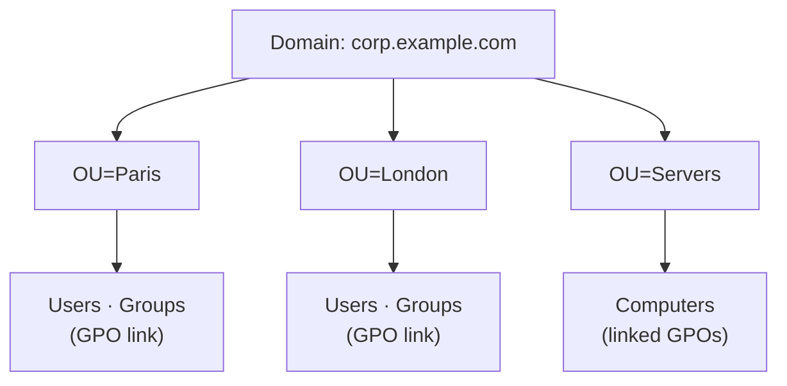
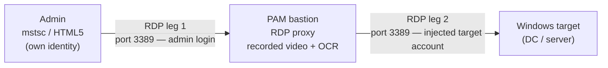
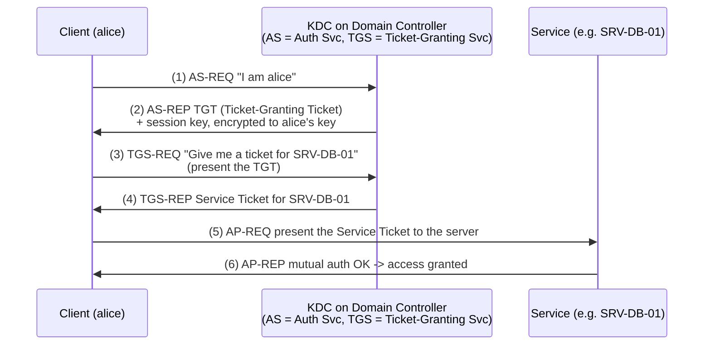
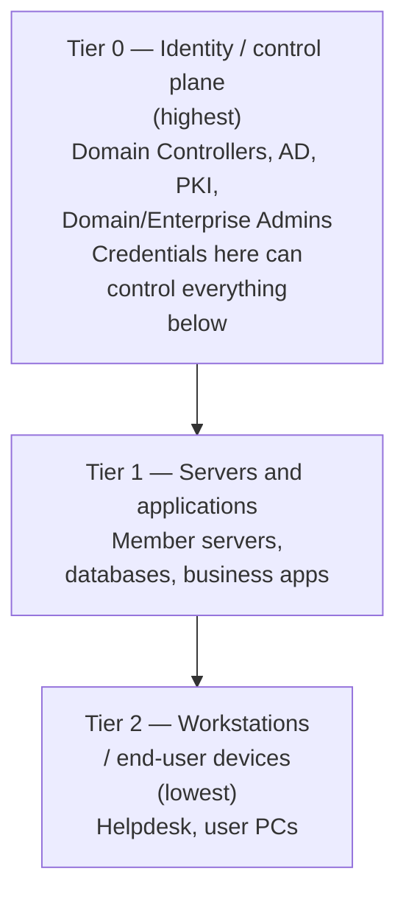

# Windows and Active Directory for PAM

Most enterprises run **Microsoft Active Directory (AD)** as their identity backbone, and
most privileged targets are **Windows servers** reached over **Remote Desktop Protocol
(RDP)**. A **PAM bastion** integrates tightly with AD: it authenticates users against
AD/LDAP, brokers RDP sessions through its RDP proxy engine, and can use **Kerberos** to
reach targets. To master PAM (Privileged Access Management) you must first understand
the Windows/AD world it protects. This file builds that foundation from first principles
and ties each concept to the PAM bastion.

## Learning objectives

By the end of this file you should be able to:

- Describe **AD objects**: users, groups, **Organizational Units (OUs)**, and
  **Group Policy Objects (GPOs)**.
- Explain the role of a **Domain Controller (DC)**.
- Compare **NTLM** vs **Kerberos** authentication and walk through the Kerberos flow.
- Identify high-value **privileged groups** (Domain Admins, Enterprise Admins) and the
  risk of **service accounts**.
- Explain **LAPS** (Local Administrator Password Solution) and the **Microsoft
  tiered-admin model**.
- Connect AD/LDAP integration, RDP proxying, and Kerberos auth to how a PAM bastion
  operates.

See also [../reference/acronyms.md](../reference/acronyms.md) and
[networking-and-protocols.md](networking-and-protocols.md).

---

## 1. Active Directory objects

**Active Directory (AD)** is Microsoft's directory service: a hierarchical database of
identity and policy objects for a Windows **domain** (e.g., `corp.example.com`). The
core objects:

| Object | What it is | Example |
|--------|------------|---------|
| **User** | A person/account that logs in | `alice@corp.example.com` |
| **Group** | A bundle of users (and groups) for permission assignment | `Domain Admins`, `IT-Helpdesk` |
| **Organizational Unit (OU)** | A container that organizes objects and is the unit GPOs attach to | `OU=Servers,OU=Paris` |
| **Group Policy Object (GPO)** | A policy bundle (security, software, settings) linked to a site/domain/OU | "Disable USB on workstations" |
| **Computer** | A machine joined to the domain | `SRV-DB-01` |

- **OUs** are about *administration and policy scope* (where a GPO applies).
- **Groups** are about *permissions* (who can access what). Don't confuse them.

> **PAM tie-in:** A PAM bastion connects to AD over **LDAP/LDAPS** (Lightweight Directory
> Access Protocol, ports **389/636**) to authenticate users and **map AD groups to
> PAM user groups**. You define an AD group like `PAM-Admins`, and the bastion grants
> those members the matching authorizations — so AD remains the single source of truth.

---

## 2. Domain Controllers (DCs)

A **Domain Controller (DC)** is a Windows Server that hosts the AD database, answers
authentication requests, and runs the **Kerberos Key Distribution Center (KDC)**.
Domains usually have **two or more DCs** for redundancy; they replicate to each other.

- DCs serve **LDAP** (directory queries, 389/636), **Kerberos** (88), **DNS** (53), and
  **Global Catalog** (3268/3269).
- Compromise a DC and you effectively own the domain — which is exactly why privileged
  access to DCs must be brokered and recorded.

> **PAM tie-in:** DCs are among the **most critical targets** PAM protects. The bastion
> talks to a DC for LDAP authentication and (optionally) Kerberos, and admins reach the
> DC *through* the bastion over RDP — never directly.

---

## 3. RDP — Remote Desktop Protocol

**RDP (Remote Desktop Protocol)** is Microsoft's graphical remote-access protocol
(default **TCP port 3389**). It streams the Windows desktop to a client (`mstsc.exe`)
and sends back keyboard/mouse input. Modern RDP adds:

- **NLA (Network Level Authentication):** authenticate *before* a session is created
  (most PAM proxies enable it by default).
- **TLS (Transport Layer Security):** encrypts the channel.
- **Kerberos:** preferred authentication when available.

> **PAM tie-in:** A PAM bastion's RDP proxy engine sits between the admin's client and
> the Windows target. Typical engines support **NLA**, **Kerberos**, and TLS controls,
> record the RDP session as **full-color video** (often with OCR of window titles), and
> an optional agent on Windows targets collects rich metadata (window titles, process
> start/stop, clipboard) while **masking keystrokes in password fields**. RDP
> **sub-protocols** (clipboard, drive, printer, smartcard, audio) are individually
> allow/deny per authorization.

---

## 4. NTLM vs Kerberos

Windows has two authentication protocols. Knowing the difference is core PAM literacy.

| | **NTLM** | **Kerberos** |
|---|---|---|
| Full name | NT LAN Manager | Kerberos (MIT, RFC 4120) |
| Model | Challenge–response, **per-server** | **Ticket-based**, central KDC |
| Crypto | Hash of the password (NT hash) | Symmetric keys + tickets, timestamps |
| Mutual auth | No (client doesn't verify server) | **Yes** |
| Default since | Legacy/fallback | Windows 2000+ (preferred in AD) |
| Known abuses | **Pass-the-Hash**, relay attacks | Kerberoasting, Golden/Silver Ticket |

NTLM is the **legacy fallback**; it sends a challenge-response derived from the password
hash and is vulnerable to **Pass-the-Hash** (stealing the hash to impersonate the user
without knowing the password). Kerberos is the modern default in AD and uses
short-lived **tickets** issued by the DC.

### FLOW: Kerberos authentication (AS-REQ → TGT → TGS → service)

Kerberos has three parties: the **Client**, the **KDC** (Key Distribution Center, running
on the DC, split into an **Authentication Service / AS** and **Ticket-Granting Service /
TGS**), and the **target Service** (e.g., a file server or RDP host).

**Plain-English walk-through:**
1. **AS-REQ:** Client asks the KDC's Authentication Service to log in.
2. **AS-REP:** KDC returns a **Ticket-Granting Ticket (TGT)** — a time-limited "proof I
   already authenticated," encrypted so only the KDC can later read it.
3. **TGS-REQ:** To reach a specific service, the client presents the TGT and asks for a
   **service ticket**.
4. **TGS-REP:** KDC issues a **Service Ticket** scoped to that one service.
5. **AP-REQ:** Client presents the Service Ticket directly to the target service.
6. **AP-REP:** Service validates it (and proves its own identity — **mutual auth**);
   access granted. **The password itself is never sent to the service.**

> **PAM tie-in:** A PAM bastion uses **Kerberos** both as a way users authenticate *to*
> the bastion and as a way the bastion authenticates *to* targets. Expert-level PAM
> curricula distinguish **explicit** Kerberos (the bastion holds the target credential
> and obtains tickets itself) from **transparent** Kerberos (the user's own ticket is
> passed through), and modern RDP proxies prefer Kerberos over NTLM by default. See
> [../protocols/kerberos.md](../protocols/kerberos.md).

---

## 5. Privileged groups and service accounts

### The crown-jewel groups

| Group | Power |
|-------|-------|
| **Domain Admins** | Full control of *the domain* (every member server, every user) |
| **Enterprise Admins** | Full control of *the entire forest* (all domains) |
| **Schema Admins** | Can modify the AD schema itself |
| **Administrators (local)** | Full control of *one machine* |

Membership in these groups is the highest-value prize for an attacker — and the primary
thing PAM exists to govern. Best practice: **keep them nearly empty**, grant access
**Just-in-Time (JIT)**, and broker every use through PAM.

### Service accounts

A **service account** is an account a *program/service* logs in as (e.g., a backup
agent, a database service). They are dangerous because they often have:
- high privilege, and
- **passwords that "never change"** (changing them risks breaking the service), so they
  rot for years.

> **PAM tie-in:** A PAM **password vault** is built precisely for this: it **vaults and
> automatically rotates** service-account passwords and SSH keys, removing static
> credentials from scripts and config files. The script/RPA case is known as **AAPM
> (Application-to-Application Password Management)**, realized via the vault's REST API
> and application plugins (see
> [../foundations/privileged-accounts-and-credentials.md](../foundations/privileged-accounts-and-credentials.md)).

---

## 6. LAPS — Local Administrator Password Solution

Every Windows machine has a built-in **local Administrator** account. If they all share
the *same* password (a common sin), one stolen password unlocks every machine
(lateral movement). **LAPS (Local Administrator Password Solution)** is Microsoft's
free tool that sets a **unique, random local-admin password per machine** and stores it
securely in AD, rotating it on a schedule.

> **PAM tie-in:** This is the same *problem* PAM solves from the vault side — a bastion
> vaults and rotates privileged credentials centrally. (On the endpoint side, **Endpoint
> Privilege Management (EPM)** tools rotate local-account passwords to be *unique per
> computer and per account* — see
> [../foundations/pam-iam-iga-idaas-epm.md](../foundations/pam-iam-iga-idaas-epm.md).)
> LAPS and PAM are complementary layers of the same least-privilege philosophy.

---

## 7. The Microsoft tiered-admin model

To stop a single compromised admin from cascading into total domain takeover, Microsoft
defines **administrative tiers** that must not cross:

> **Rule:** a Tier-0 admin credential must **never** be typed on a Tier-1/2 machine — or it can be stolen and used to climb back up.

The point: credentials of one tier must never be exposed on a lower tier, because a
lower tier is more exposed to compromise.

> **PAM tie-in:** A PAM broker *enforces* tiering operationally. Admins connect to a
> clean broker; the high-tier credential is **injected by the bastion and never lands on
> the admin's workstation**, so it can't be harvested by malware on a lower-tier device.
> JIT access and session recording reinforce the model. Build it hands-on in the tiered
> AD lab: [../certs/ceh/labs/README.md](../certs/ceh/labs/README.md).

---

## How this maps to PAM roles

- **PAM administrator / professional level:** RDP and proxy concepts plus AD/LDAP
  integration are foundational.
- **PAM expert level:** advanced authentication covers RADIUS, **Kerberos
  explicit/transparent**, X.509, and SAML — the AD/Kerberos understanding here is a
  direct prerequisite (see [../protocols/kerberos.md](../protocols/kerberos.md) and
  [../protocols/active-directory.md](../protocols/active-directory.md)).

---

## Sources

- Microsoft — Active Directory Domain Services overview: https://learn.microsoft.com/en-us/windows-server/identity/ad-ds/get-started/virtual-dc/active-directory-domain-services-overview
- Microsoft — Group Policy overview: https://learn.microsoft.com/en-us/previous-versions/windows/it-pro/windows-server-2012-r2-and-2012/hh831791(v=ws.11)
- RFC 4120 — The Kerberos Network Authentication Service (V5): https://www.rfc-editor.org/rfc/rfc4120
- Microsoft — Kerberos authentication overview: https://learn.microsoft.com/en-us/windows-server/security/kerberos/kerberos-authentication-overview
- Microsoft — NTLM overview: https://learn.microsoft.com/en-us/windows-server/security/windows-authentication/ntlm-overview
- Microsoft — Remote Desktop Protocol: https://learn.microsoft.com/en-us/windows/win32/termserv/remote-desktop-protocol
- Microsoft — Local Administrator Password Solution (Windows LAPS): https://learn.microsoft.com/en-us/windows-server/identity/laps/laps-overview
- Microsoft — Enterprise access model / tiered administration: https://learn.microsoft.com/en-us/security/privileged-access-workstations/privileged-access-access-model
